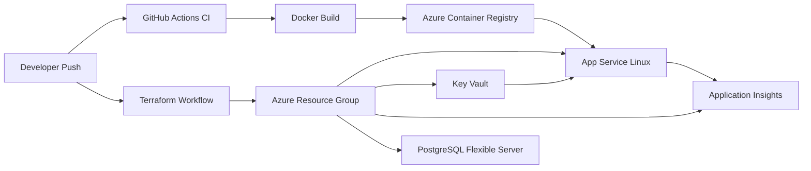

# Azure DevOps Learning Project (Student Edition)

A cost-aware DevOps learning project built around a simple ASP.NET Core 8 Task API.

## What This Project Covers

- ASP.NET Core 8 Web API with JWT auth
- Entity Framework Core with PostgreSQL
- Swagger/OpenAPI with Bearer token support
- Health checks at `/health`
- Docker multi-stage image build
- Docker Compose local stack (API + PostgreSQL)
- Terraform provisioning for Azure infrastructure
- GitHub Actions for CI, CD, and Terraform validation
- Azure Key Vault for secrets
- Application Insights + Log Analytics for monitoring

## Architecture



## Local Run (Docker Compose)

1. Start stack:

```bash
docker compose up --build -d
```

2. Open Swagger:

- http://localhost:8080/swagger

3. Get JWT token:

- `POST /api/auth/token`
- Body:

```json
{
  "username": "student",
  "password": "Pass@123"
}
```

4. Click **Authorize** in Swagger and paste token as `Bearer <token>`.

5. Use `/api/tasks` endpoints.

6. Check health:

- `GET /health`

## Project Structure

- `src/TaskApi`: API source code
- `tests/TaskApi.Tests`: unit tests
- `infra/terraform`: Azure IaC
- `.github/workflows`: CI/CD and Terraform pipelines

## Azure Setup (Student-Friendly)

### 1) Create service principal for GitHub OIDC

Configure workload identity federation and set GitHub secrets:

- `AZURE_CLIENT_ID`
- `AZURE_TENANT_ID`
- `AZURE_SUBSCRIPTION_ID`
- `JWT_SECRET`

### 2) Provision infrastructure

```bash
cd infra/terraform
cp terraform.tfvars.example terraform.tfvars
# Edit terraform.tfvars with your values
terraform init
terraform plan
terraform apply
```

### 3) Add deployment secrets from Terraform outputs

After apply, set these GitHub secrets:

- `ACR_NAME`
- `ACR_LOGIN_SERVER`
- `RESOURCE_GROUP_NAME`
- `WEBAPP_NAME`

### 4) Deploy

Push to `main` (or run CD workflow manually).

## Cost Notes for Azure for Students

- Uses small SKUs (`B1` App Service, `Basic` ACR, `B_Standard_B1ms` PostgreSQL).
- Set `create_postgres = false` in Terraform if you want to pause DB costs and use local DB only.
- Delete resource group when not practicing.
- Keep one environment (`dev`) only.

## CI/CD Workflows

- `ci.yml`: restore, build, test, Docker build smoke check
- `cd.yml`: build + push container image and update App Service container
- `terraform.yml`: fmt, init, validate, plan; optional apply via manual dispatch

## Next Learning Iterations

- Add integration tests with Testcontainers
- Add EF Core migrations pipeline step
- Add staging slot and approval gates
- Add OpenTelemetry tracing for deeper observability
